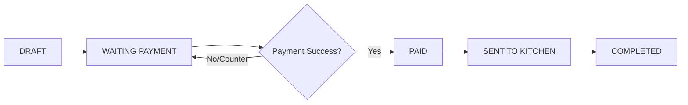

# 🍽️ RestoQR Ecosystem
### Smart QR-Based Restaurant Ordering System

RestoQR is a modern, web-based restaurant management and ordering solution designed to streamline the dining experience. By leveraging table-specific QR codes, it bridges the gap between digital convenience and physical service.

---

## 🚀 Key Features

### 🛒 For Customers (Public)
- **Zero-Login Ordering**: Scan, browse, and order without the friction of account creation.
- **Table-Level Autonomy**: Each QR code is uniquely tied to a specific table.
- **Smart Cart Management**: Real-time order drafting and review.
- **Flexible Payments**: Support for both Online (FPX) and Cash/Card (Pay-at-Counter).

### 👩‍🍳 For Staff (Operational)
- **Live Order Feed**: Real-time tracking of incoming orders.
- **Status Lifecycle**: Manage orders from `WAITING_PAYMENT` to `SENT_TO_KITCHEN`.
- **Menu Control**: Instant toggle for item availability.
- **Receipt Printing**: Integrated workflow for committing orders.

### 📊 For Admins (Management)
- **Restaurant Profile**: Centralized branding and settings.
- **Dynamic Menu Management**: Complete control over categories, items, and pricing.
- **QR Generation**: Instant QR code generation for new or existing tables.
- **Sales Reporting**: Daily summaries and historical order data.

---

## 🛠️ Technology Stack

- **Backend**: [Laravel 10](https://laravel.com) (PHP 8.1+)
- **Frontend**: Blade Templates, [Tailwind CSS](https://tailwindcss.com), Vite
- **Database**: MySQL / PostgreSQL
- **Real-time**: Laravel Echo (Pusher/Reverb)
- **Security**: Laravel Sanctum

---

## 🔄 Order Lifecycle



---

## 📥 Installation

1. **Clone the repository**:
   ```bash
   git clone https://github.com/Ali-Imran01/restaurant-system.git
   ```

2. **Install dependencies**:
   ```bash
   composer install
   npm install && npm run build
   ```

3. **Configure Environment**:
   ```bash
   cp .env.example .env
   php artisan key:generate
   ```

4. **Database Setup**:
   ```bash
   php artisan migrate --seed
   ```

5. **Serve the application**:
   ```bash
   php artisan serve
   ```

---

## 📄 License

This project is open-sourced software licensed under the [MIT license](https://opensource.org/licenses/MIT).
